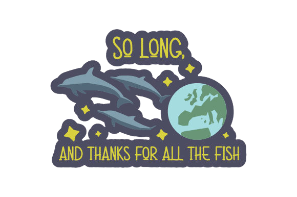

<p align="center"></p>

<div align="center">

</div>

This 2D game project use the sprite sheet of baba is you [Baba is you](https://store.steampowered.com/app/736260/Baba_Is_You/) please try the game its pretty damn cool buy

<h1 align="center"> Description </h1>

<p align="center">This project is a small 2D game with minilibx.</p>
<p align="center">You'll learn about textures, sprites and tiles.</p>

<h1 align="center"> Dependencies </h1>

<p align="center">
Custom libft for so_long, Work on linux and mac os, not on windows.
</p>

<h1 align="center"> Getting Started </h1>

<p align="center">
Requirements for linux
</p>

```bash
➜  ~ sudo apt-get install xorg openbox
➜  ~ sudo apt-get install libxext-dev libbsd-dev
```

<p align="center">
Requirements for MacOS
</p>

 - 🚨 [Xquartz](https://www.xquartz.org/)

```bash
➜  ~ Brew install Xquartz
➜  ~ reboot
➜  ~ xeyes # run an hello world X11 app
```
- [Get the repo](git@github.com:ComlanGiovanni/so_long.git)
```
~ git clone git@github.com:ComlanGiovanni/so_long.git
```
```
~ make re && make bonus
```
```
so_long and so_long is now generate
```

<h1 align="center"> Executing program </h1>

```
./so_long 42.ber
```

```
./so_long_bons maps/maps_bonus/42.ber
```

<h1 align="center">
HOW TO PLAY
</h1>

<p align="center">The player’s goal is to collect all collectibles present on the map by escaping with minimal movement.</p>

|KEYBOARD|ACTION|
|---|---|
|`W`, `↑`|Move up|
|`S`, `↓`|Move down|
|`A`, `←`|Move left|
|`D`, `→`|Move right|
|`ESC ⎋`|Close the game|


<h1 align="center"> Acknowledgments </h1>

* [Intro](https://www.youtube.com/watch?v=N_dUmDBfp6k) - [Book](https://www.amazon.fr/So-Long-Thanks-All-Fish/dp/1529034558) - [42 vid](https://elearning.intra.42.fr/notions/minilibx/subnotions) - [MinilibxGit](https://github.com/42Paris/minilibx-linux) - [MinilibxDoc](https://harm-smits.github.io/42docs/libs/minilibx/introduction.html) - [MinilibxTester](https://github.com/augustobecker/so_long_tester) - [MLX42](https://github.com/codam-coding-college/MLX42) - [Xpm convertor](https://convertio.co/fr/png-xpm/) - [Xpm convertor 2](https://anyconv.com/fr/convertisseur-de-png-en-xpm/) - [Background remove](https://www.remove.bg/) - [Tuto](https://achedeuzot.me/2014/12/20/installer-la-minilibx/) - [Assets](https://itch.io/game-assets/free/tag-sprites) - [fun](https://www.youtube.com/watch?v=OCh2l0J1uJk) - [baba is you](https://babaiswiki.fandom.com/wiki/Category:Nouns) - [vert](https://www.vertopal.com/) - [diff](https://www.diffchecker.com/) - [Aspite](https://www.aseprite.org/) - [Baba is you](https://hempuli.com/baba/) - [color hexa for xpm](https://www.color-hex.com/) - [Some rust doc milibx](https://docs.rs/minilibx/latest/minilibx/struct.Mlx.html) - [Remove background](https://www.remove.bg/fr/upload) - [Baba all sprite](https://www.spriters-resource.com/fullview/115231/) - [Maze Generator](https://www.dcode.fr/maze-generator) - [More png](https://www.vhv.rs/) - [Minlibx tuto](https://aurelienbrabant.fr/blog) - [Png tools](https://onlinepngtools.com=)


<div align='right'>

In 2 week by -> [@ComlanGiovanni](https://github.com/ComlanGiovanni)

</div>